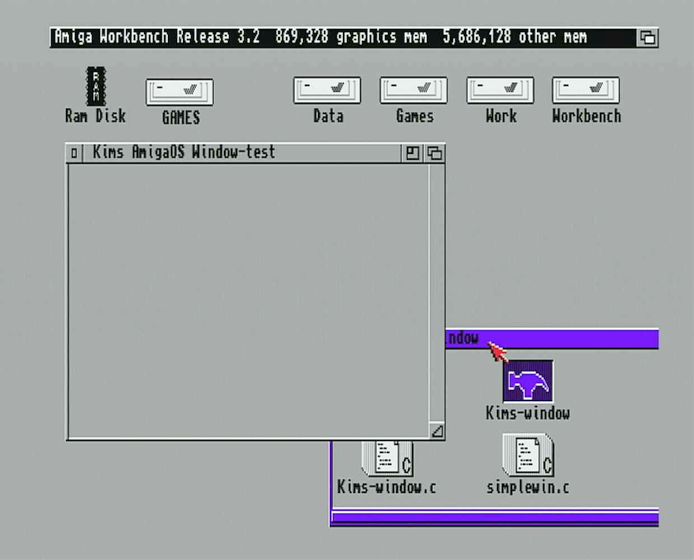

# C on Amiga

## Getting Started

[amigaos-dev](amigaos-dev) contains instructions on setting up `C` cross-development in Linux for `AmigaOS` / `m68k`.

[intuition-window](intuition-window) contains sample `C` source code for `AmigaOS` / `Workbench`.

