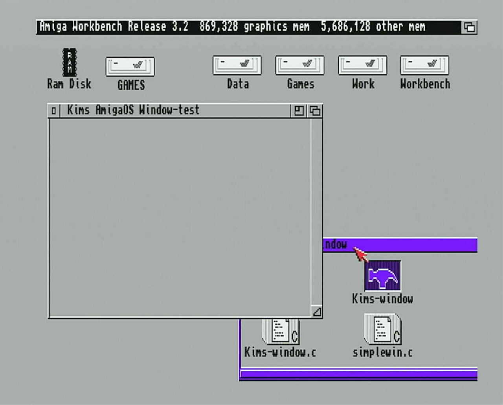

# C development for Amiga, on Linux.

## Getting Started

### Needed:
- LHA decompression tool (_lhasa_)
- VBCC (_C Cross-Compiler for Amiga_)
- Cross-compiler targets (`AmigaOS/m68k`)
- NDK 3.9 (_Development Kit_)
- VASM (_Assembler for Amiga_)
- VLINK (_Linker for Amiga_)

[amigaos-dev/](amigaos-dev/) - contains instructions on setting up `C` cross-development in Linux for `AmigaOS` / `m68k` arch.

[demo-launcher/](demo-launcher/) - contains source code for a intuition/AmigaOS (_windowed_) demo-launcher program.

## GUI / Windowing System

[Intuition](https://en.wikipedia.org/wiki/Intuition_(Amiga)) is the native windowing system and user interface (`UI`) engine of `AmigaOS`. It was developed almost entirely by [**RJ Mical**](https://en.wikipedia.org/wiki/RJ_Mical).

   > Not to be confused with [`Workbench`](https://en.wikipedia.org/wiki/Workbench_(AmigaOS)), which is the desktop environment and graphical file manager in `AmigaOS`.

[intuition-window/](intuition-window/) - contains sample `C` source code for a simple `AmigaOS` / `Workbench` window.

### Sample Intuition Window programmed in **Amiga C**

